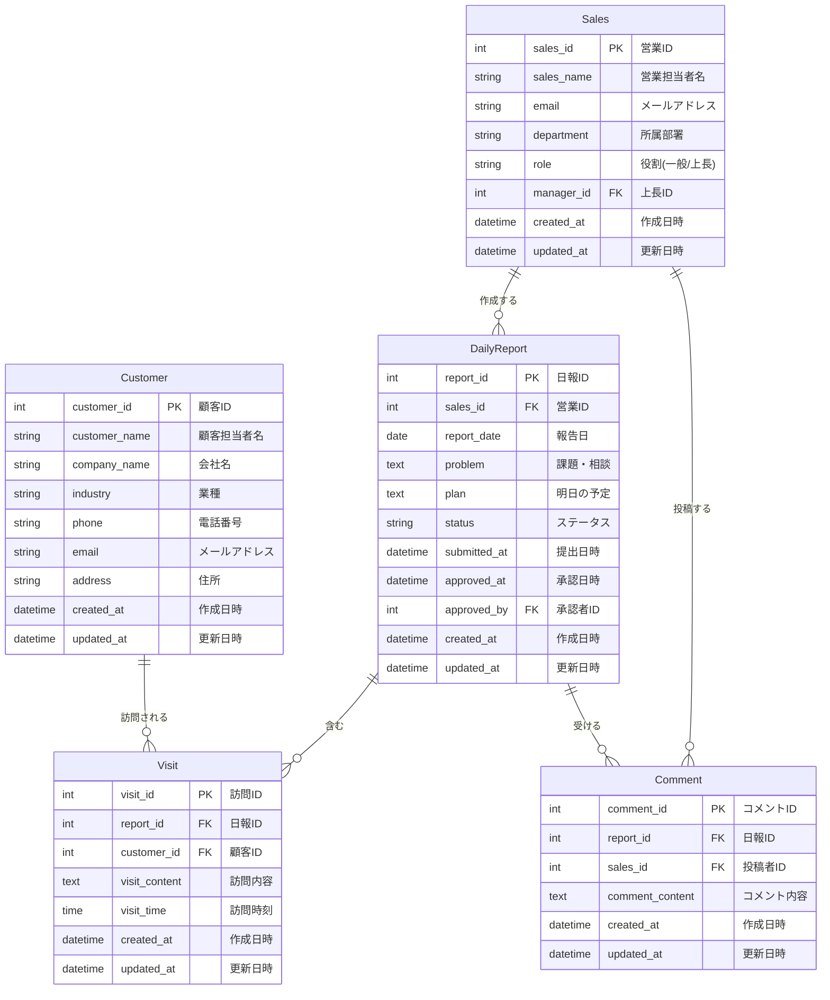

# 営業日報システム ER図

## テーブル説明

### Sales（営業マスタ）

営業担当者の基本情報を管理。role で一般営業と上長を区別。

### Customer（顧客マスタ）

訪問先顧客の情報を管理。

### DailyReport（日報）

1営業担当者が1日1件作成。Problem（課題・相談）とPlan（明日の予定）を記録。
ステータス: '下書き', '提出済み', '承認済み', '差し戻し'

### Visit（訪問記録）

1つの日報に複数の訪問記録を紐付け。訪問内容を詳細に記録。

### Comment（コメント）

上長や営業担当者が日報に対してフィードバック。複数コメント可能。
