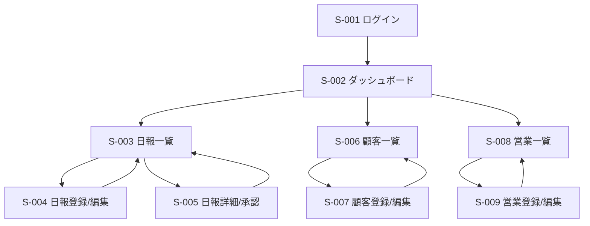
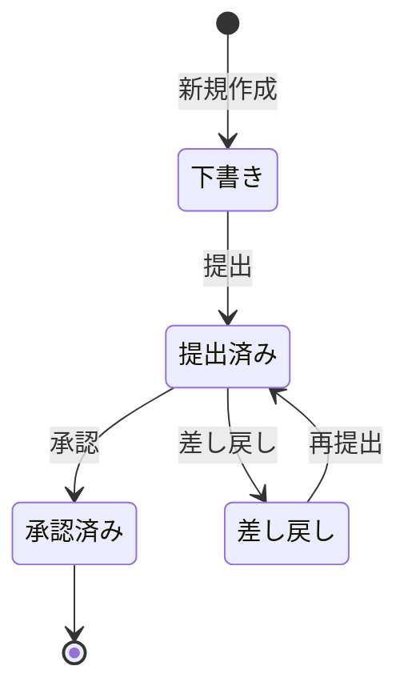

# 営業日報システム 画面定義書

## 1. 画面一覧

| 画面ID | 画面名 | 対象ユーザー | 説明 |
|--------|--------|--------------|------|
| S-001 | ログイン画面 | 全ユーザー | システムへのログイン |
| S-002 | ダッシュボード | 全ユーザー | ホーム画面、日報状況の概要表示 |
| S-003 | 日報一覧画面 | 全ユーザー | 日報の一覧表示・検索 |
| S-004 | 日報登録/編集画面 | 営業担当者 | 日報の新規登録・編集 |
| S-005 | 日報詳細/承認画面 | 全ユーザー | 日報の詳細表示・承認・コメント |
| S-006 | 顧客マスタ一覧画面 | 全ユーザー | 顧客情報の一覧表示・検索 |
| S-007 | 顧客マスタ登録/編集画面 | 営業担当者、上長 | 顧客情報の新規登録・編集 |
| S-008 | 営業マスタ一覧画面 | 上長 | 営業担当者の一覧表示 |
| S-009 | 営業マスタ登録/編集画面 | 上長 | 営業担当者情報の登録・編集 |

## 2. 画面遷移図



## 3. 画面詳細仕様

---

### S-001 ログイン画面

#### 画面概要
- システムへのログイン認証を行う

#### 画面レイアウト
```
+----------------------------------+
|     営業日報システム              |
+----------------------------------+
| メールアドレス                    |
| [                    ]           |
|                                  |
| パスワード                        |
| [                    ]           |
|                                  |
| [ログイン]                        |
|                                  |
| エラーメッセージ表示エリア         |
+----------------------------------+
```

#### 画面項目

| 項目ID | 項目名 | 項目タイプ | 必須 | 最大文字数 | 初期値 | 備考 |
|--------|--------|------------|------|-----------|--------|------|
| L-001 | メールアドレス | テキスト | ○ | 255 | - | メールアドレス形式 |
| L-002 | パスワード | パスワード | ○ | 255 | - | マスク表示 |
| L-003 | ログインボタン | ボタン | - | - | - | - |

#### バリデーション

| 項目ID | バリデーション内容 | エラーメッセージID |
|--------|-------------------|-------------------|
| L-001 | 必須入力チェック | E-001 |
| L-001 | メールアドレス形式チェック | E-002 |
| L-002 | 必須入力チェック | E-003 |
| - | 認証チェック | E-004 |

#### 操作フロー
1. メールアドレスとパスワードを入力
2. ログインボタンをクリック
3. 認証成功時、ダッシュボード（S-002）へ遷移
4. 認証失敗時、エラーメッセージを表示

---

### S-002 ダッシュボード

#### 画面概要
- ログイン後のホーム画面
- 日報の状況サマリーを表示

#### 画面レイアウト
```
+--------------------------------------------------+
| ヘッダー [ログアウト]                              |
+--------------------------------------------------+
| ナビゲーション                                     |
| [ダッシュボード] [日報一覧] [顧客一覧] [営業一覧]   |
+--------------------------------------------------+
| ようこそ、{営業担当者名}さん                       |
|                                                  |
| 【本日の日報】                                    |
| ステータス: [下書き/提出済み/承認済み]              |
| [日報作成/編集]                                   |
|                                                  |
| 【承認待ち日報】 ※上長のみ表示                     |
| - YYYY/MM/DD {営業担当者名} [詳細]                |
| - YYYY/MM/DD {営業担当者名} [詳細]                |
|                                                  |
| 【最近の日報】                                    |
| - YYYY/MM/DD ステータス [詳細]                    |
| - YYYY/MM/DD ステータス [詳細]                    |
|                                                  |
+--------------------------------------------------+
```

#### 画面項目

| 項目ID | 項目名 | 項目タイプ | 必須 | 備考 |
|--------|--------|------------|------|------|
| D-001 | ログアウトボタン | ボタン | - | ヘッダー部 |
| D-002 | ナビゲーションメニュー | メニュー | - | - |
| D-003 | 営業担当者名 | テキスト | - | ログインユーザー名表示 |
| D-004 | 本日の日報ステータス | テキスト | - | - |
| D-005 | 日報作成/編集ボタン | ボタン | - | S-004へ遷移 |
| D-006 | 承認待ち日報リスト | リスト | - | 上長のみ表示 |
| D-007 | 最近の日報リスト | リスト | - | 直近5件表示 |

#### 権限
- 一般営業: 自分の日報のみ表示
- 上長: 自分と配下メンバーの日報、承認待ち日報を表示

---

### S-003 日報一覧画面

#### 画面概要
- 日報の一覧表示と検索

#### 画面レイアウト
```
+--------------------------------------------------+
| ヘッダー [ログアウト]                              |
+--------------------------------------------------+
| ナビゲーション                                     |
+--------------------------------------------------+
| 【検索条件】                                       |
| 期間: [YYYY/MM/DD] ～ [YYYY/MM/DD]               |
| 営業担当者: [▼選択]  ※上長のみ                    |
| ステータス: [▼すべて]                             |
| [検索] [クリア]                                   |
|                                                  |
| [新規日報作成] ※営業担当者のみ                     |
|                                                  |
| 【検索結果】 全 XX件                              |
| +------------------------------------------+     |
| | 日付 | 営業担当 | ステータス | 操作      |     |
| +------------------------------------------+     |
| | 2024/01/06 | 山田太郎 | 承認済み | [詳細] |     |
| | 2024/01/05 | 山田太郎 | 提出済み | [詳細] |     |
| +------------------------------------------+     |
| [< 前へ] [1] [2] [3] [次へ >]                   |
+--------------------------------------------------+
```

#### 画面項目

| 項目ID | 項目名 | 項目タイプ | 必須 | 最大文字数 | 初期値 | 備考 |
|--------|--------|------------|------|-----------|--------|------|
| R-001 | 期間(開始) | 日付 | - | - | 当月初日 | カレンダー選択 |
| R-002 | 期間(終了) | 日付 | - | - | 当月末日 | カレンダー選択 |
| R-003 | 営業担当者 | セレクトボックス | - | - | 全て | 上長のみ表示 |
| R-004 | ステータス | セレクトボックス | - | - | すべて | 下書き/提出済み/承認済み/差し戻し |
| R-005 | 検索ボタン | ボタン | - | - | - | - |
| R-006 | クリアボタン | ボタン | - | - | - | 検索条件をクリア |
| R-007 | 新規日報作成ボタン | ボタン | - | - | - | S-004へ遷移 |
| R-008 | 検索結果一覧 | テーブル | - | - | - | ページング対応 |

#### バリデーション

| 項目ID | バリデーション内容 | エラーメッセージID |
|--------|-------------------|-------------------|
| R-001, R-002 | 日付形式チェック | E-005 |
| R-001, R-002 | 期間整合性チェック（開始≦終了） | E-006 |

#### 権限
- 一般営業: 自分の日報のみ表示・検索
- 上長: 自分と配下メンバーの日報を表示・検索

---

### S-004 日報登録/編集画面

#### 画面概要
- 日報の新規登録および編集

#### 画面レイアウト
```
+--------------------------------------------------+
| ヘッダー [ログアウト]                              |
+--------------------------------------------------+
| ナビゲーション                                     |
+--------------------------------------------------+
| 【日報登録/編集】                                  |
|                                                  |
| 報告日: [YYYY/MM/DD] ※必須                       |
| ステータス: {表示のみ}                             |
|                                                  |
| 【訪問記録】                                       |
| +------------------------------------------+     |
| | 訪問時刻 | 顧客 | 訪問内容 | 操作        |     |
| +------------------------------------------+     |
| | 09:00 | ABC株式会社 | 新規提案 | [編集][削除] |  |
| +------------------------------------------+     |
| [訪問記録を追加]                                  |
|                                                  |
| 課題・相談: ※任意                                 |
| +------------------------------------------+     |
| |                                          |     |
| |                                          |     |
| +------------------------------------------+     |
|                                                  |
| 明日の予定: ※任意                                 |
| +------------------------------------------+     |
| |                                          |     |
| |                                          |     |
| +------------------------------------------+     |
|                                                  |
| [下書き保存] [提出] [キャンセル]                   |
|                                                  |
| エラーメッセージ表示エリア                          |
+--------------------------------------------------+

【訪問記録追加/編集モーダル】
+----------------------------------+
| 訪問記録                          |
+----------------------------------+
| 訪問時刻: [HH:MM] ※必須          |
| 顧客: [▼選択] ※必須              |
| 訪問内容: ※必須                   |
| +----------------------------+   |
| |                            |   |
| |                            |   |
| +----------------------------+   |
| [保存] [キャンセル]               |
+----------------------------------+
```

#### 画面項目

| 項目ID | 項目名 | 項目タイプ | 必須 | 最大文字数 | 初期値 | 備考 |
|--------|--------|------------|------|-----------|--------|------|
| DR-001 | 報告日 | 日付 | ○ | - | 当日 | カレンダー選択 |
| DR-002 | ステータス | テキスト | - | - | - | 表示のみ |
| DR-003 | 訪問記録一覧 | テーブル | - | - | - | 複数登録可能 |
| DR-004 | 訪問記録追加ボタン | ボタン | - | - | - | モーダル表示 |
| DR-005 | 訪問時刻 | 時刻 | ○ | - | - | HH:MM形式 |
| DR-006 | 顧客 | セレクトボックス | ○ | - | - | 顧客マスタから選択 |
| DR-007 | 訪問内容 | テキストエリア | ○ | 1000 | - | - |
| DR-008 | 課題・相談 | テキストエリア | - | 2000 | - | - |
| DR-009 | 明日の予定 | テキストエリア | - | 2000 | - | - |
| DR-010 | 下書き保存ボタン | ボタン | - | - | - | ステータス: 下書き |
| DR-011 | 提出ボタン | ボタン | - | - | - | ステータス: 提出済み |
| DR-012 | キャンセルボタン | ボタン | - | - | - | 一覧へ戻る |

#### バリデーション

| 項目ID | バリデーション内容 | エラーメッセージID |
|--------|-------------------|-------------------|
| DR-001 | 必須入力チェック | E-007 |
| DR-001 | 日付形式チェック | E-005 |
| DR-001 | 同日の日報重複チェック | E-008 |
| DR-005 | 必須入力チェック | E-009 |
| DR-005 | 時刻形式チェック（HH:MM） | E-010 |
| DR-006 | 必須選択チェック | E-011 |
| DR-007 | 必須入力チェック | E-012 |
| DR-007 | 最大文字数チェック（1000文字） | E-013 |
| DR-008 | 最大文字数チェック（2000文字） | E-014 |
| DR-009 | 最大文字数チェック（2000文字） | E-015 |
| - | 提出時: 訪問記録1件以上チェック | E-016 |

#### 操作フロー

**新規登録時:**
1. 報告日を選択（デフォルト: 当日）
2. 訪問記録を追加（1件以上）
3. 課題・相談、明日の予定を入力
4. 下書き保存または提出

**編集時:**
1. 既存データを表示
2. 項目を編集
3. 下書き保存または提出

**制約:**
- ステータスが「提出済み」「承認済み」の日報は編集不可
- ステータスが「差し戻し」の日報は編集可能

---

### S-005 日報詳細/承認画面

#### 画面概要
- 日報の詳細表示
- 上長による承認・差し戻し
- コメント投稿

#### 画面レイアウト
```
+--------------------------------------------------+
| ヘッダー [ログアウト]                              |
+--------------------------------------------------+
| ナビゲーション                                     |
+--------------------------------------------------+
| 【日報詳細】                                       |
|                                                  |
| 営業担当者: {営業担当者名}                         |
| 報告日: {YYYY/MM/DD}                             |
| ステータス: [下書き/提出済み/承認済み/差し戻し]     |
| 提出日時: {YYYY/MM/DD HH:MM}                     |
| 承認日時: {YYYY/MM/DD HH:MM}                     |
| 承認者: {承認者名}                                |
|                                                  |
| 【訪問記録】                                       |
| +------------------------------------------+     |
| | 訪問時刻 | 顧客 | 訪問内容              |     |
| +------------------------------------------+     |
| | 09:00 | ABC株式会社 | 新規提案の説明... |     |
| +------------------------------------------+     |
|                                                  |
| 課題・相談:                                       |
| {課題・相談内容}                                   |
|                                                  |
| 明日の予定:                                       |
| {明日の予定内容}                                   |
|                                                  |
| 【コメント】                                       |
| +------------------------------------------+     |
| | {投稿者名} {YYYY/MM/DD HH:MM}          |     |
| | {コメント内容}                           |     |
| +------------------------------------------+     |
|                                                  |
| コメント入力:                                      |
| +------------------------------------------+     |
| |                                          |     |
| +------------------------------------------+     |
| [コメント投稿]                                    |
|                                                  |
| [承認] [差し戻し] [戻る] ※上長のみ、提出済みのみ   |
|                                                  |
+--------------------------------------------------+
```

#### 画面項目

| 項目ID | 項目名 | 項目タイプ | 必須 | 最大文字数 | 備考 |
|--------|--------|------------|------|-----------|------|
| RD-001 | 営業担当者 | テキスト | - | - | 表示のみ |
| RD-002 | 報告日 | テキスト | - | - | 表示のみ |
| RD-003 | ステータス | テキスト | - | - | 表示のみ |
| RD-004 | 提出日時 | テキスト | - | - | 表示のみ |
| RD-005 | 承認日時 | テキスト | - | - | 表示のみ |
| RD-006 | 承認者 | テキスト | - | - | 表示のみ |
| RD-007 | 訪問記録一覧 | テーブル | - | - | 表示のみ |
| RD-008 | 課題・相談 | テキスト | - | - | 表示のみ |
| RD-009 | 明日の予定 | テキスト | - | - | 表示のみ |
| RD-010 | コメント一覧 | リスト | - | - | 新しい順で表示 |
| RD-011 | コメント入力 | テキストエリア | - | 1000 | - |
| RD-012 | コメント投稿ボタン | ボタン | - | - | - |
| RD-013 | 承認ボタン | ボタン | - | - | 上長のみ表示 |
| RD-014 | 差し戻しボタン | ボタン | - | - | 上長のみ表示 |
| RD-015 | 戻るボタン | ボタン | - | - | - |

#### バリデーション

| 項目ID | バリデーション内容 | エラーメッセージID |
|--------|-------------------|-------------------|
| RD-011 | 最大文字数チェック（1000文字） | E-017 |
| RD-011 | コメント投稿時の必須入力チェック | E-018 |

#### 操作フロー

**コメント投稿:**
1. コメントを入力
2. コメント投稿ボタンをクリック
3. コメントがリストに追加される

**承認（上長のみ）:**
1. 日報内容を確認
2. 承認ボタンをクリック
3. ステータスが「承認済み」に変更
4. 承認日時、承認者が記録される

**差し戻し（上長のみ）:**
1. 日報内容を確認
2. 差し戻しボタンをクリック
3. ステータスが「差し戻し」に変更
4. 営業担当者が再編集可能になる

#### 権限
- 承認・差し戻しボタン: 上長かつステータスが「提出済み」の場合のみ表示
- コメント投稿: 全ユーザー可能

---

### S-006 顧客マスタ一覧画面

#### 画面概要
- 顧客情報の一覧表示と検索

#### 画面レイアウト
```
+--------------------------------------------------+
| ヘッダー [ログアウト]                              |
+--------------------------------------------------+
| ナビゲーション                                     |
+--------------------------------------------------+
| 【顧客検索】                                       |
| 会社名: [              ]                         |
| 業種: [▼すべて]                                   |
| [検索] [クリア]                                   |
|                                                  |
| [新規顧客登録]                                    |
|                                                  |
| 【検索結果】 全 XX件                              |
| +------------------------------------------+     |
| | 会社名 | 顧客名 | 業種 | 電話 | 操作    |     |
| +------------------------------------------+     |
| | ABC株式会社 | 山田 | IT | 03-xxxx | [詳細][編集] |
| +------------------------------------------+     |
| [< 前へ] [1] [2] [3] [次へ >]                   |
+--------------------------------------------------+
```

#### 画面項目

| 項目ID | 項目名 | 項目タイプ | 必須 | 最大文字数 | 初期値 | 備考 |
|--------|--------|------------|------|-----------|--------|------|
| C-001 | 会社名（検索） | テキスト | - | 255 | - | 部分一致検索 |
| C-002 | 業種（検索） | セレクトボックス | - | - | すべて | - |
| C-003 | 検索ボタン | ボタン | - | - | - | - |
| C-004 | クリアボタン | ボタン | - | - | - | - |
| C-005 | 新規顧客登録ボタン | ボタン | - | - | - | S-007へ遷移 |
| C-006 | 検索結果一覧 | テーブル | - | - | - | ページング対応 |

---

### S-007 顧客マスタ登録/編集画面

#### 画面概要
- 顧客情報の新規登録および編集

#### 画面レイアウト
```
+--------------------------------------------------+
| ヘッダー [ログアウト]                              |
+--------------------------------------------------+
| ナビゲーション                                     |
+--------------------------------------------------+
| 【顧客登録/編集】                                  |
|                                                  |
| 会社名: [                    ] ※必須             |
| 顧客担当者名: [              ] ※必須             |
| 業種: [▼選択]                                     |
| 電話番号: [                  ]                   |
| メールアドレス: [            ]                    |
| 住所: [                      ]                   |
|                                                  |
| [登録/更新] [キャンセル]                          |
|                                                  |
| エラーメッセージ表示エリア                          |
+--------------------------------------------------+
```

#### 画面項目

| 項目ID | 項目名 | 項目タイプ | 必須 | 最大文字数 | 初期値 | 備考 |
|--------|--------|------------|------|-----------|--------|------|
| CE-001 | 会社名 | テキスト | ○ | 255 | - | - |
| CE-002 | 顧客担当者名 | テキスト | ○ | 100 | - | - |
| CE-003 | 業種 | セレクトボックス | - | - | - | IT/製造/金融/小売/サービス/その他 |
| CE-004 | 電話番号 | テキスト | - | 20 | - | ハイフン含む |
| CE-005 | メールアドレス | テキスト | - | 255 | - | メールアドレス形式 |
| CE-006 | 住所 | テキスト | - | 500 | - | - |
| CE-007 | 登録/更新ボタン | ボタン | - | - | - | - |
| CE-008 | キャンセルボタン | ボタン | - | - | - | 一覧へ戻る |

#### バリデーション

| 項目ID | バリデーション内容 | エラーメッセージID |
|--------|-------------------|-------------------|
| CE-001 | 必須入力チェック | E-019 |
| CE-001 | 最大文字数チェック（255文字） | E-020 |
| CE-002 | 必須入力チェック | E-021 |
| CE-002 | 最大文字数チェック（100文字） | E-022 |
| CE-004 | 電話番号形式チェック | E-023 |
| CE-005 | メールアドレス形式チェック | E-002 |
| CE-005 | 最大文字数チェック（255文字） | E-024 |
| CE-006 | 最大文字数チェック（500文字） | E-025 |

---

### S-008 営業マスタ一覧画面

#### 画面概要
- 営業担当者情報の一覧表示（上長のみアクセス可）

#### 画面レイアウト
```
+--------------------------------------------------+
| ヘッダー [ログアウト]                              |
+--------------------------------------------------+
| ナビゲーション                                     |
+--------------------------------------------------+
| 【営業担当者検索】                                 |
| 担当者名: [              ]                        |
| 部署: [▼すべて]                                   |
| 役割: [▼すべて]                                   |
| [検索] [クリア]                                   |
|                                                  |
| [新規営業担当者登録]                               |
|                                                  |
| 【検索結果】 全 XX件                              |
| +------------------------------------------+     |
| | 担当者名 | 部署 | 役割 | 上長 | 操作    |     |
| +------------------------------------------+     |
| | 山田太郎 | 営業1部 | 一般 | 佐藤 | [詳細][編集] |
| +------------------------------------------+     |
| [< 前へ] [1] [2] [3] [次へ >]                   |
+--------------------------------------------------+
```

#### 画面項目

| 項目ID | 項目名 | 項目タイプ | 必須 | 最大文字数 | 初期値 | 備考 |
|--------|--------|------------|------|-----------|--------|------|
| S-001 | 担当者名（検索） | テキスト | - | 100 | - | 部分一致検索 |
| S-002 | 部署（検索） | セレクトボックス | - | - | すべて | - |
| S-003 | 役割（検索） | セレクトボックス | - | - | すべて | 一般/上長 |
| S-004 | 検索ボタン | ボタン | - | - | - | - |
| S-005 | クリアボタン | ボタン | - | - | - | - |
| S-006 | 新規営業担当者登録ボタン | ボタン | - | - | - | S-009へ遷移 |
| S-007 | 検索結果一覧 | テーブル | - | - | - | ページング対応 |

#### 権限
- この画面は上長のみアクセス可能

---

### S-009 営業マスタ登録/編集画面

#### 画面概要
- 営業担当者情報の新規登録および編集（上長のみアクセス可）

#### 画面レイアウト
```
+--------------------------------------------------+
| ヘッダー [ログアウト]                              |
+--------------------------------------------------+
| ナビゲーション                                     |
+--------------------------------------------------+
| 【営業担当者登録/編集】                            |
|                                                  |
| 営業担当者名: [              ] ※必須             |
| メールアドレス: [            ] ※必須             |
| パスワード: [                ] ※新規のみ必須      |
| 所属部署: [                  ] ※必須             |
| 役割: [▼選択] ※必須                              |
| 上長: [▼選択]                                    |
|                                                  |
| [登録/更新] [キャンセル]                          |
|                                                  |
| エラーメッセージ表示エリア                          |
+--------------------------------------------------+
```

#### 画面項目

| 項目ID | 項目名 | 項目タイプ | 必須 | 最大文字数 | 初期値 | 備考 |
|--------|--------|------------|------|-----------|--------|------|
| SE-001 | 営業担当者名 | テキスト | ○ | 100 | - | - |
| SE-002 | メールアドレス | テキスト | ○ | 255 | - | ユニーク |
| SE-003 | パスワード | パスワード | ○* | 255 | - | 新規登録時のみ必須 |
| SE-004 | 所属部署 | テキスト | ○ | 100 | - | - |
| SE-005 | 役割 | セレクトボックス | ○ | - | - | 一般/上長 |
| SE-006 | 上長 | セレクトボックス | - | - | - | 役割=上長のユーザーから選択 |
| SE-007 | 登録/更新ボタン | ボタン | - | - | - | - |
| SE-008 | キャンセルボタン | ボタン | - | - | - | 一覧へ戻る |

#### バリデーション

| 項目ID | バリデーション内容 | エラーメッセージID |
|--------|-------------------|-------------------|
| SE-001 | 必須入力チェック | E-026 |
| SE-001 | 最大文字数チェック（100文字） | E-027 |
| SE-002 | 必須入力チェック | E-001 |
| SE-002 | メールアドレス形式チェック | E-002 |
| SE-002 | メールアドレス重複チェック | E-028 |
| SE-003 | 必須入力チェック（新規時） | E-029 |
| SE-003 | パスワード強度チェック（8文字以上） | E-030 |
| SE-004 | 必須入力チェック | E-031 |
| SE-004 | 最大文字数チェック（100文字） | E-032 |
| SE-005 | 必須選択チェック | E-033 |

#### 権限
- この画面は上長のみアクセス可能

---

## 4. バリデーション一覧

| バリデーションID | バリデーション名 | チェック内容 |
|-----------------|-----------------|-------------|
| V-001 | 必須入力チェック | 入力必須項目が未入力の場合エラー |
| V-002 | メールアドレス形式チェック | メールアドレスの形式が正しくない場合エラー |
| V-003 | 日付形式チェック | 日付の形式が正しくない場合エラー（YYYY/MM/DD） |
| V-004 | 時刻形式チェック | 時刻の形式が正しくない場合エラー（HH:MM） |
| V-005 | 電話番号形式チェック | 電話番号の形式が正しくない場合エラー（数字とハイフン） |
| V-006 | 最大文字数チェック | 指定文字数を超過している場合エラー |
| V-007 | 数値範囲チェック | 数値が指定範囲外の場合エラー |
| V-008 | 期間整合性チェック | 開始日が終了日より後の場合エラー |
| V-009 | 重複チェック | 同一データが既に存在する場合エラー |
| V-010 | パスワード強度チェック | パスワードが8文字未満の場合エラー |

---

## 5. エラーメッセージ一覧

| エラーID | エラーメッセージ | 表示タイミング |
|---------|-----------------|---------------|
| E-001 | メールアドレスを入力してください。 | ログイン画面、営業マスタ登録 |
| E-002 | メールアドレスの形式が正しくありません。 | メールアドレス入力時 |
| E-003 | パスワードを入力してください。 | ログイン画面 |
| E-004 | メールアドレスまたはパスワードが正しくありません。 | ログイン認証失敗時 |
| E-005 | 日付の形式が正しくありません。 | 日付入力時 |
| E-006 | 終了日は開始日以降の日付を指定してください。 | 期間検索時 |
| E-007 | 報告日を選択してください。 | 日報登録時 |
| E-008 | 同じ日付の日報が既に存在します。 | 日報登録時（重複） |
| E-009 | 訪問時刻を入力してください。 | 訪問記録登録時 |
| E-010 | 訪問時刻の形式が正しくありません。（HH:MM形式で入力してください） | 訪問時刻入力時 |
| E-011 | 顧客を選択してください。 | 訪問記録登録時 |
| E-012 | 訪問内容を入力してください。 | 訪問記録登録時 |
| E-013 | 訪問内容は1000文字以内で入力してください。 | 訪問内容入力時 |
| E-014 | 課題・相談は2000文字以内で入力してください。 | 課題・相談入力時 |
| E-015 | 明日の予定は2000文字以内で入力してください。 | 明日の予定入力時 |
| E-016 | 日報を提出するには、訪問記録を1件以上登録してください。 | 日報提出時 |
| E-017 | コメントは1000文字以内で入力してください。 | コメント入力時 |
| E-018 | コメントを入力してください。 | コメント投稿時 |
| E-019 | 会社名を入力してください。 | 顧客登録時 |
| E-020 | 会社名は255文字以内で入力してください。 | 会社名入力時 |
| E-021 | 顧客担当者名を入力してください。 | 顧客登録時 |
| E-022 | 顧客担当者名は100文字以内で入力してください。 | 顧客担当者名入力時 |
| E-023 | 電話番号の形式が正しくありません。 | 電話番号入力時 |
| E-024 | メールアドレスは255文字以内で入力してください。 | メールアドレス入力時 |
| E-025 | 住所は500文字以内で入力してください。 | 住所入力時 |
| E-026 | 営業担当者名を入力してください。 | 営業マスタ登録時 |
| E-027 | 営業担当者名は100文字以内で入力してください。 | 営業担当者名入力時 |
| E-028 | このメールアドレスは既に登録されています。 | 営業マスタ登録時 |
| E-029 | パスワードを入力してください。 | 営業マスタ新規登録時 |
| E-030 | パスワードは8文字以上で入力してください。 | パスワード入力時 |
| E-031 | 所属部署を入力してください。 | 営業マスタ登録時 |
| E-032 | 所属部署は100文字以内で入力してください。 | 所属部署入力時 |
| E-033 | 役割を選択してください。 | 営業マスタ登録時 |
| E-999 | システムエラーが発生しました。管理者にお問い合わせください。 | システムエラー時 |

---

## 6. 共通仕様

### 6.1 ヘッダー
全画面共通でヘッダーを表示
- システム名「営業日報システム」
- ログインユーザー名
- ログアウトボタン

### 6.2 ナビゲーション
ログイン後の全画面で表示
- ダッシュボード
- 日報一覧
- 顧客一覧
- 営業一覧（上長のみ）

### 6.3 権限制御

| 役割 | 権限 |
|------|------|
| 一般営業 | - 自分の日報の作成・編集・削除<br>- 自分の日報の閲覧<br>- 顧客マスタの登録・編集・閲覧<br>- コメントの投稿・閲覧 |
| 上長 | - 一般営業の全権限<br>- 配下メンバーの日報閲覧<br>- 日報の承認・差し戻し<br>- 営業マスタの登録・編集・閲覧 |

### 6.4 ページング
一覧画面は1ページ20件表示

### 6.5 日時表示形式
- 日付: YYYY/MM/DD
- 時刻: HH:MM
- 日時: YYYY/MM/DD HH:MM

### 6.6 ステータス遷移



### 6.7 操作制限
- 下書き: 作成者のみ編集・削除可能
- 提出済み: 編集不可、上長のみ承認・差し戻し可能
- 承認済み: 編集・削除不可
- 差し戻し: 作成者のみ編集可能

### 6.8 レスポンシブデザイン
- PC、タブレット、スマートフォンでの表示に対応
- ブレイクポイント: 768px（タブレット）、480px（スマートフォン）

### 6.9 セッション管理
- セッションタイムアウト: 30分
- タイムアウト時はログイン画面へ自動遷移

### 6.10 確認ダイアログ
以下の操作時に確認ダイアログを表示
- 日報の削除
- 日報の提出
- 日報の承認
- 日報の差し戻し
- マスタデータの削除

---

## 7. 非機能要件

### 7.1 パフォーマンス
- 画面表示: 3秒以内
- 検索処理: 5秒以内
- 登録・更新処理: 2秒以内

### 7.2 ブラウザ対応
- Google Chrome（最新版）
- Microsoft Edge（最新版）
- Safari（最新版）
- Firefox（最新版）

### 7.3 セキュリティ
- パスワードはハッシュ化して保存
- SQLインジェクション対策実施
- XSS（クロスサイトスクリプティング）対策実施
- CSRF（クロスサイトリクエストフォージェリ）対策実施
- HTTPS通信の使用

### 7.4 アクセシビリティ
- WCAG 2.1 レベルAA準拠
- キーボード操作対応
- スクリーンリーダー対応

---

## 8. 改訂履歴

| 版数 | 改訂日 | 改訂内容 | 作成者 |
|------|--------|---------|--------|
| 1.0 | 2024/01/06 | 初版作成 | - |
