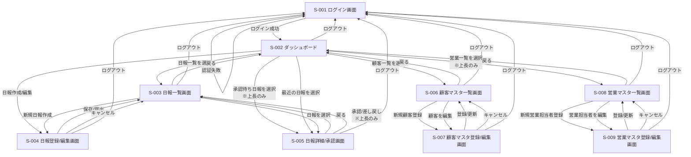
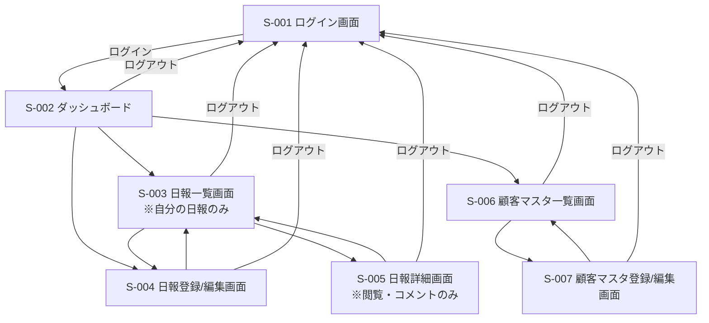
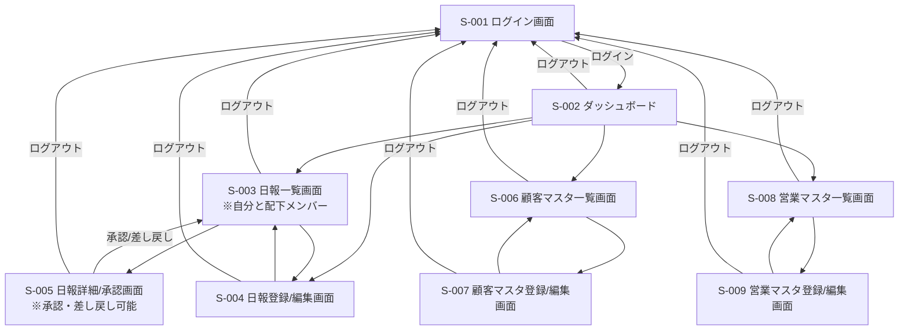
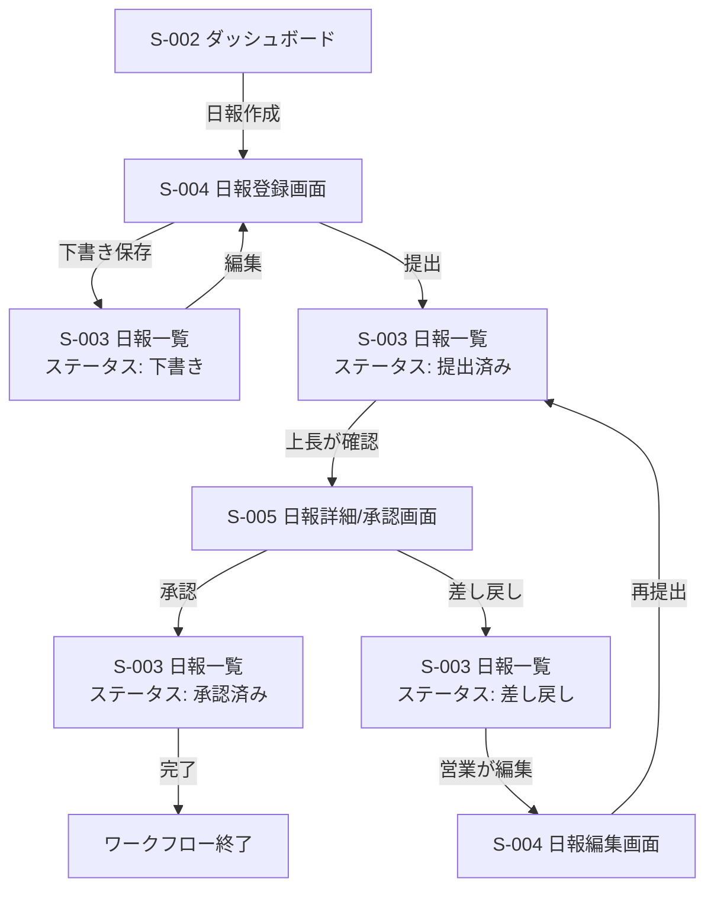

# 営業日報システム 画面遷移図

## 1. 全体画面遷移図

## 2. 役割別画面遷移図

### 2.1 一般営業担当者の画面遷移

### 2.2 上長の画面遷移

## 3. 日報ワークフロー画面遷移

## 4. 画面遷移詳細仕様

### 4.1 ログイン関連

| 遷移元画面     | 操作                   | 遷移先画面           | 条件                   |
| -------------- | ---------------------- | -------------------- | ---------------------- |
| S-001 ログイン | ログインボタン         | S-002 ダッシュボード | 認証成功               |
| S-001 ログイン | ログインボタン         | S-001 ログイン       | 認証失敗（エラー表示） |
| 全画面         | ログアウトボタン       | S-001 ログイン       | -                      |
| 全画面         | セッションタイムアウト | S-001 ログイン       | 30分無操作             |

### 4.2 ダッシュボード関連

| 遷移元画面           | 操作                | 遷移先画面          | 条件                           |
| -------------------- | ------------------- | ------------------- | ------------------------------ |
| S-002 ダッシュボード | 日報一覧を選択      | S-003 日報一覧      | -                              |
| S-002 ダッシュボード | 日報作成/編集ボタン | S-004 日報登録/編集 | 本日の日報が未作成または下書き |
| S-002 ダッシュボード | 承認待ち日報の詳細  | S-005 日報詳細/承認 | 上長のみ                       |
| S-002 ダッシュボード | 最近の日報の詳細    | S-005 日報詳細/承認 | -                              |
| S-002 ダッシュボード | 顧客一覧を選択      | S-006 顧客一覧      | -                              |
| S-002 ダッシュボード | 営業一覧を選択      | S-008 営業一覧      | 上長のみ                       |

### 4.3 日報関連

| 遷移元画面          | 操作               | 遷移先画面           | 条件                                |
| ------------------- | ------------------ | -------------------- | ----------------------------------- |
| S-003 日報一覧      | 新規日報作成ボタン | S-004 日報登録       | 営業担当者                          |
| S-003 日報一覧      | 日報行を選択       | S-005 日報詳細/承認  | -                                   |
| S-003 日報一覧      | 戻るボタン         | S-002 ダッシュボード | -                                   |
| S-004 日報登録/編集 | 下書き保存ボタン   | S-003 日報一覧       | バリデーション成功                  |
| S-004 日報登録/編集 | 提出ボタン         | S-003 日報一覧       | バリデーション成功、訪問記録1件以上 |
| S-004 日報登録/編集 | キャンセルボタン   | S-003 日報一覧       | 確認ダイアログでOK                  |
| S-005 日報詳細/承認 | 承認ボタン         | S-003 日報一覧       | 上長のみ、ステータス=提出済み       |
| S-005 日報詳細/承認 | 差し戻しボタン     | S-003 日報一覧       | 上長のみ、ステータス=提出済み       |
| S-005 日報詳細/承認 | 戻るボタン         | S-003 日報一覧       | -                                   |

### 4.4 顧客マスタ関連

| 遷移元画面          | 操作               | 遷移先画面           | 条件               |
| ------------------- | ------------------ | -------------------- | ------------------ |
| S-006 顧客一覧      | 新規顧客登録ボタン | S-007 顧客登録       | -                  |
| S-006 顧客一覧      | 編集ボタン         | S-007 顧客編集       | -                  |
| S-006 顧客一覧      | 戻るボタン         | S-002 ダッシュボード | -                  |
| S-007 顧客登録/編集 | 登録/更新ボタン    | S-006 顧客一覧       | バリデーション成功 |
| S-007 顧客登録/編集 | キャンセルボタン   | S-006 顧客一覧       | -                  |

### 4.5 営業マスタ関連

| 遷移元画面          | 操作                     | 遷移先画面           | 条件                         |
| ------------------- | ------------------------ | -------------------- | ---------------------------- |
| S-008 営業一覧      | 新規営業担当者登録ボタン | S-009 営業登録       | 上長のみ                     |
| S-008 営業一覧      | 編集ボタン               | S-009 営業編集       | 上長のみ                     |
| S-008 営業一覧      | 戻るボタン               | S-002 ダッシュボード | -                            |
| S-009 営業登録/編集 | 登録/更新ボタン          | S-008 営業一覧       | バリデーション成功、上長のみ |
| S-009 営業登録/編集 | キャンセルボタン         | S-008 営業一覧       | -                            |

## 5. 画面遷移時のデータ受け渡し

### 5.1 日報編集時

| 遷移元               | 遷移先         | 受け渡しデータ      |
| -------------------- | -------------- | ------------------- |
| S-003 日報一覧       | S-004 日報編集 | report_id（日報ID） |
| S-002 ダッシュボード | S-004 日報編集 | report_date（当日） |

### 5.2 日報詳細表示時

| 遷移元               | 遷移先         | 受け渡しデータ      |
| -------------------- | -------------- | ------------------- |
| S-003 日報一覧       | S-005 日報詳細 | report_id（日報ID） |
| S-002 ダッシュボード | S-005 日報詳細 | report_id（日報ID） |

### 5.3 顧客編集時

| 遷移元         | 遷移先         | 受け渡しデータ        |
| -------------- | -------------- | --------------------- |
| S-006 顧客一覧 | S-007 顧客編集 | customer_id（顧客ID） |

### 5.4 営業担当者編集時

| 遷移元         | 遷移先         | 受け渡しデータ     |
| -------------- | -------------- | ------------------ |
| S-008 営業一覧 | S-009 営業編集 | sales_id（営業ID） |

## 6. 確認ダイアログが表示される遷移

以下の操作時には確認ダイアログを表示し、ユーザーの同意を得てから遷移する。

| 画面                | 操作                 | 確認メッセージ                                             |
| ------------------- | -------------------- | ---------------------------------------------------------- |
| S-004 日報登録/編集 | キャンセル（編集中） | 入力内容が破棄されます。よろしいですか？                   |
| S-004 日報登録/編集 | 提出ボタン           | 日報を提出します。提出後は編集できません。よろしいですか？ |
| S-004 日報登録/編集 | 訪問記録削除         | この訪問記録を削除します。よろしいですか？                 |
| S-005 日報詳細/承認 | 承認ボタン           | この日報を承認します。よろしいですか？                     |
| S-005 日報詳細/承認 | 差し戻しボタン       | この日報を差し戻します。よろしいですか？                   |
| S-007 顧客登録/編集 | キャンセル（編集中） | 入力内容が破棄されます。よろしいですか？                   |
| S-009 営業登録/編集 | キャンセル（編集中） | 入力内容が破棄されます。よろしいですか？                   |

## 7. エラー時の画面遷移

### 7.1 バリデーションエラー

バリデーションエラー発生時は画面遷移せず、同一画面でエラーメッセージを表示する。

| 画面                | 操作            | エラー時の動作       |
| ------------------- | --------------- | -------------------- |
| S-001 ログイン      | ログインボタン  | 同一画面でエラー表示 |
| S-004 日報登録/編集 | 提出/保存ボタン | 同一画面でエラー表示 |
| S-007 顧客登録/編集 | 登録/更新ボタン | 同一画面でエラー表示 |
| S-009 営業登録/編集 | 登録/更新ボタン | 同一画面でエラー表示 |

### 7.2 権限エラー

権限のない画面にアクセスしようとした場合は、ダッシュボードへリダイレクトし、エラーメッセージを表示する。

### 7.3 システムエラー

システムエラー発生時は、エラー画面を表示し、ダッシュボードへ戻るリンクを提供する。

## 8. URLパス設計（参考）

| 画面ID | 画面名             | URLパス             | HTTPメソッド |
| ------ | ------------------ | ------------------- | ------------ |
| S-001  | ログイン画面       | /login              | GET, POST    |
| S-002  | ダッシュボード     | /dashboard          | GET          |
| S-003  | 日報一覧画面       | /reports            | GET          |
| S-004  | 日報登録画面       | /reports/new        | GET, POST    |
| S-004  | 日報編集画面       | /reports/:id/edit   | GET, PUT     |
| S-005  | 日報詳細/承認画面  | /reports/:id        | GET          |
| S-006  | 顧客マスタ一覧画面 | /customers          | GET          |
| S-007  | 顧客マスタ登録画面 | /customers/new      | GET, POST    |
| S-007  | 顧客マスタ編集画面 | /customers/:id/edit | GET, PUT     |
| S-008  | 営業マスタ一覧画面 | /sales              | GET          |
| S-009  | 営業マスタ登録画面 | /sales/new          | GET, POST    |
| S-009  | 営業マスタ編集画面 | /sales/:id/edit     | GET, PUT     |
| -      | ログアウト         | /logout             | POST         |

## 9. ブラウザバック時の動作

| 画面                 | ブラウザバック時の動作               |
| -------------------- | ------------------------------------ |
| S-001 ログイン       | （前画面なし）                       |
| S-002 ダッシュボード | ログアウト処理を実行                 |
| S-003 日報一覧       | ダッシュボードへ戻る                 |
| S-004 日報登録/編集  | 確認ダイアログ表示後、日報一覧へ戻る |
| S-005 日報詳細/承認  | 日報一覧へ戻る                       |
| S-006 顧客一覧       | ダッシュボードへ戻る                 |
| S-007 顧客登録/編集  | 確認ダイアログ表示後、顧客一覧へ戻る |
| S-008 営業一覧       | ダッシュボードへ戻る                 |
| S-009 営業登録/編集  | 確認ダイアログ表示後、営業一覧へ戻る |

## 10. 改訂履歴

| 版数 | 改訂日     | 改訂内容 | 作成者 |
| ---- | ---------- | -------- | ------ |
| 1.0  | 2024/01/06 | 初版作成 | -      |
